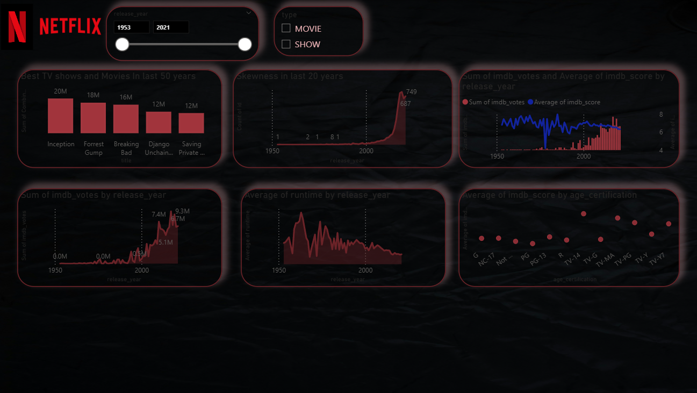

# Netflix Power BI Dashboard

## Overview
This project presents an interactive dashboard built using Power BI to analyze Netflix movies and TV shows data. The dashboard highlights trends, patterns, and insights related to content performance, ratings, and audience engagement over time.
This was my first Power BI Dashboard.. 

## Objectives
- Analyze content trends across years  
- Compare Movies vs TV Shows  
- Evaluate IMDB ratings and vote patterns  
- Understand runtime distribution  
- Explore age certification impact  

## Tool Used
- Power BI  

## Key Features
- Dynamic filtering using slicers (Release Year, Content Type)  
- Interactive visuals for trend analysis  
- Clean and dark-themed dashboard design  
- Outlier handling for better accuracy  
- Time-based analysis of content growth  

## Key Insights
- Significant growth in content after 2000  
- Movies dominate overall content compared to TV Shows  
- IMDB votes increased sharply in recent years  
- Runtime has gradually decreased over time  
- Certain age certifications have higher average ratings  

## Dashboard Preview
 

## Learnings
- Data cleaning and transformation in Power BI  
- Writing DAX measures for analysis  
- Designing user-friendly dashboards  
- Handling skewed data using value capping  
- Creating meaningful business insights from raw data

## Author
Datawithrajat
